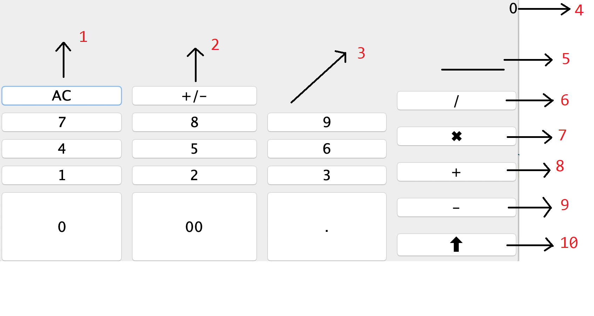

# SWE 510 Data Structures and Algorithms

<b>Student Name : </b>Sabri Korkmaz
 
<b>Submission Date : </b>23/12/2020 
 
<b>Project Title : </b> RPN Calculator
 
<b>Project Type : </b> Java Based Programming Project
 

# Introduction
Bu proje Reverse Polish Notation [RPN](https://en.wikipedia.org/wiki/Reverse_Polish_notation) adlı bir matematiksel hesaplama yöntemi kullanarak işlem yapan bir hesap makinesidir. 

# RPN Calculator

### Calculator Arayüzü

1. Ac Button : Removes the current number
2. Sign Button : Determine sign of current number
3. Number Panel : Includes all the numbers
4. Result : Present the result of the calculatiom
5. Memory : Presenet of the data in the memory
6. Divide : Divide operation
7. Multiply : Multiply operation
8. Summary : Summary operation
9. Subtract: Subtract operation
10. Insert : Inserts the current number into the memory

Hafızadaki bütün sayılar ^ işareti ile ayrılarak Memory alanında gösterirlir.

### CalculatorEngine 
Calculator Engine is the main structure that contains all transactions. The operations and fields are as follows.

 #### Fields
- <b>Stack _dataPool :</b> Stores values of Calculators
- <b>int Sign :</b> Store the state of current Number sign

#### Methods
- <b>Stack operation(OperationType type)</b>
    - Read operation type from parameter and processes values in the _dataPool
        - OperationType.Sum
        - OperationType.Multiply
        - OperationType.Divide
        - OperationType.Subtract
- <b>String renderDataPool()</b>
    - Returns all the values in the _dataPool as a string value like '1^2^3^4'
- <b>String multiplyNumber(String currentNumber, int number)</b>
    - Multiply the current number with a specified number
- <b>String resetCalculator()</b>
    - Resets the calculator sign as 1 and returns the string 0
- <b>Stack push(String currentNumber)</b>
    - Converts the string currentNumber into BigDecimal and push it to the stack
- <b>Stack clear()</b>
    - Removes all data in the memory and returns empty array
- <b>int changeNumberSign()</b>
    - Changes sign of the engine to the opposite 
- <b>int currentNumberSing()</b>
    - Return current sign state of the engine

### StringHelper

It is a helper structure for use in string operations within the Calculator Engine.

#### Methods
- <b>String formatStr(BigDecimal val) </b>
    - Reads the number to be edited as a parameter. Formats the value with thousand and decimal seperator
- <b>String joinNumber(String currentNumber,int newValue,int sign)</b>
    - Combines the current number, new value, and sign to generate the new number
- <b> String addSeparator(String value)</b>
    - Adds seperator to raw current raw number

# Installation
Right-click on the .jar file in the project to install the application. Then, operations can be performed in the window that opens.

# Maintenance
The attached files can be used to update the project, or you can contribute via github with the link below.
[RPNCalculator on Github ](https://github.com/SabriKorkmaz/RPNCalculator.java)
